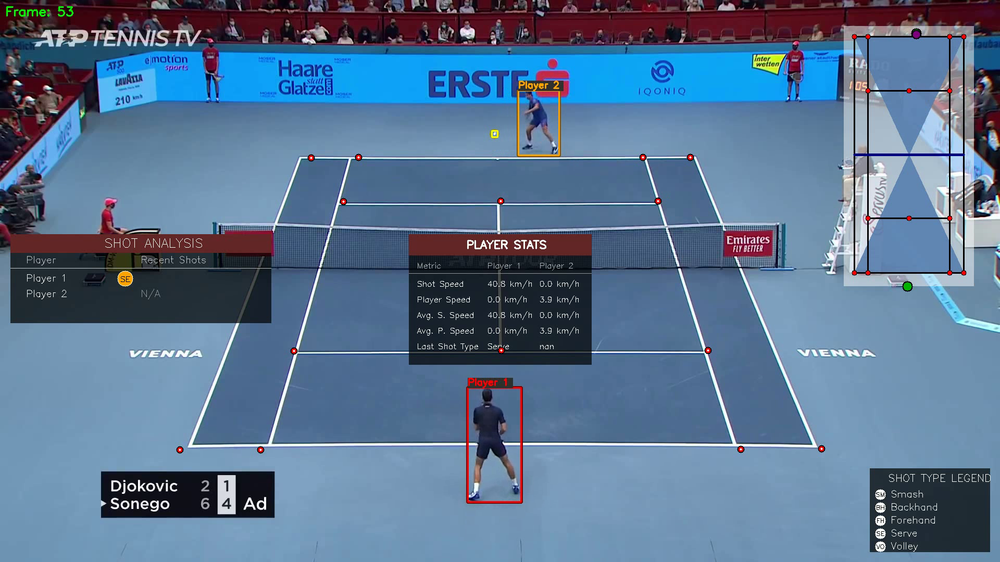

# Tennis-Vision

Tennis match analysis from a single broadcast camera: ball tracking, court geometry,
player tracking, shot classification and 3-D trajectory reconstruction.

<div align="center">
  
</div>

## The one thing that makes this different

Every number this project reports carries the evidence for it, or it is not reported.

That reads like a slogan, so here is what it means in practice. The pipeline refuses to
print a serve speed when it cannot see the ball land. It flags a clip whose court fit
failed instead of computing real-world speeds from a court fitted to the crowd. It labels
a ball height "unknown" rather than dressing up a guess. And this README publishes the
numbers that make the project look worse alongside the ones that make it look better,
because the difference between them is usually the interesting part.

Two examples from this repository:

- Ball detection is usually quoted as a "detection rate". Ours is 88.6%. Measured against
  hand-labelled ground truth, only **42.5%** of visible-ball frames are located within
  5px. Both numbers are true and they measure different things.
- Contact and bounce detection scores **87.6% recall given perfect ball positions** and
  **51.3% running real detection end to end**. The second one is what you actually get.

Every figure below names the script that produced it.

## Quickstart

```bash
git clone https://github.com/HarshTomar1234/Tennis-Vision.git
cd Tennis-Vision

python -m venv venv
source venv/bin/activate            # Windows: venv\Scripts\activate
pip install -e .

tennis-vision download-models       # about 140 MB
tennis-vision analyze input_videos/input_video_2.mp4 -o output/demo.avi
```

`download-models` prints one manual step. The TrackNet ball weights belong to their
original author and their licence is unstated, so they are fetched from that project
rather than rehosted here. Everything else downloads automatically.

Add `--max-frames 60` for a fast check before committing to a full run.

Outputs land in `output/`: an annotated video, a per-frame stats CSV, a run summary JSON,
and an interactive 3-D viewer as a single self-contained HTML file with no external
dependencies.

## What it does

**Ball tracking.** TrackNet, with the position taken from the largest connected heatmap
response rather than the mean of all responding pixels. Ball positions map to the court
through the floor homography only at floor level, meaning at a bounce or a racket contact.
While the ball is airborne the floor homography does not apply to it, so those frames
interpolate between floor-valid anchors instead of being projected as though the ball were
on the ground.

**Court geometry.** ResNet-50 keypoint regression, 14 points, re-detected per frame so
camera pan and tilt are handled, then a real perspective homography via
`cv2.findHomography`.

**Court validity gate.** The keypoint model is a plain regression head with no way to say
"this camera angle is outside my training distribution". On unfamiliar footage it returns a
tidy quadrilateral that is simply not on the court, and every real-world measurement
downstream is then computed from it and reported with full confidence. That failure is
worse than a crash because the output looks plausible. The gate samples along every
predicted line and asks whether those pixels are actually brighter than the surface a few
pixels to either side. A predicted line lying on the crowd fails; one lying on paint
passes.

**Player tracking.** YOLOv8x with ByteTrack, then a six-criteria selection aggregated
across the whole clip. Frame-zero selection was the original approach and it failed on real
footage: on one eval clip the true player is a track id that does not exist at frame zero.

**Event detection.** Three candidate generators feed a union, because each is blind to a
different event shape. y-reversal and x-velocity are hit-shaped by construction, and a
dedicated bounce generator covers what they miss. A trained trajectory classifier then
splits contacts from bounces.

**Serve detection and speed.** A serve is the only shot that is simultaneously struck
above the player's head and from the baseline or behind it. Both conditions must hold, each
is independently measurable, and a rejection reports which one failed. Speed comes from the
contact and the landing, both floor-valid, and is not reported at all when the landing is
never observed inside the service box.

**3-D reconstruction.** Between two known contacts the ball follows a parabola whose
curvature is gravity and whose endpoints are known heights, so there are no free
parameters. Height is modelled from those anchors rather than measured from the image,
because at broadcast camera angles raising the ball and pushing it further away move it in
almost the same image direction. A free ballistic fit can match the picture to a pixel
while being metres wrong in space.

**Shot classification.** Rule-based serve, forehand, backhand, volley and smash, with a
pose-based forehand and backhand upgrade via MediaPipe. The pose test is body-relative:
whether the hitting arm crosses the shoulder midline horizontally, which makes it
independent of handedness, facing, and which side of the court the player is on.

## Measured results

Scripts marked `(dataset)` need a third-party dataset that is over 7 GB and not
redistributable. See `datasets/README.md` for sources. Everything else runs against what
ships in this repository plus the downloadable weights.

### Ball localization

Against the original TrackNet dataset's own hand-labelled coordinates, 16 clips.

| Metric | Result | Script |
|---|---|---|
| Detection rate (a position was output, **not** an accuracy) | 88.6% | `eval/ball_localization_accuracy.py` (dataset) |
| Localization error vs ground truth | median **5.4px**, 90th percentile 18.0px, at 360x640 | same |
| Located within 5px of the labelled centre | 46.8% of outputs, 42.5% of visible-ball frames | same |

Detection rate and accuracy are not the same measurement, and the gap here is large. The
detector reliably finds roughly where the ball is and is not pixel-precise. That is
adequate for trajectory shape, bounce timing and speed across a flight. It is marginal for
exact landing coordinates, and it is the current ceiling on everything derived from ball
position.

### Contact and bounce event detection

Two questions with very different answers. Both are published, because the gap between
them is the honest cost of detection noise.

**Given perfect ball positions**, feeding the dataset's labelled coordinates straight into
the candidate generators. This isolates the generators and is an upper bound, not shipped
behaviour. 91 clips.

| Configuration | Recall | Precision | Script |
|---|---|---|---|
| y-reversal only | 75.8% | 88.9% | `eval/retest_union_candidates_full_pipeline.py` (dataset) |
| y-reversal + x-velocity union | 87.6% | 90.3% | same |

**Running real detection end to end**, which is what the pipeline does. 10 clips, 76
labelled contacts, trajectory classifier only.

| Postprocessing | Recall | Precision | F1 | Mean offset | Script |
|---|---|---|---|---|---|
| mean of all responding pixels (previous) | 48.7% | 92.5% | 0.638 | 3.6 frames | `eval/event_detection_on_real_detections.py` (dataset) |
| **largest connected component** (shipped) | **51.3%** | **92.9%** | **0.661** | **3.2 frames** | same |

Recall on real detections is roughly half the upper bound. Precision holds up, so the
events reported are overwhelmingly real, but about half the contacts in a rally are missed.
The cause is ball-detection noise rather than the candidate generators: a 5.4px median
localization error both manufactures reversals and buries real ones.

### Hit versus bounce classification

Trajectory-only logistic regression on ball height, vertical and horizontal velocity
change, and whether the ball reversed horizontally. No player position needed. Trained on
820 events, tested on 214 held out, split by clip rather than by event so camera, lighting
and player correlations cannot leak.

**86.4% held-out accuracy.** See `eval/train_hit_bounce_classifier.py`.

The feature set was chosen on end-to-end F1, not on this accuracy, and the two disagree:

| Features | Held-out accuracy | End-to-end shot F1 |
|---|---|---|
| height, vertical, horizontal | 84.1% | 0.737 |
| plus raw signed velocities | **89.3%** | **0.600** |
| plus horizontal reversal (shipped) | 86.4% | **0.824** |

The most accurate model on the benchmark is the worst in the product. The cause is a train
and serve mismatch: the dataset's velocities come from hand-annotated positions, while the
pipeline computes them from real detections with interpolated gaps. Raw signed velocities
took the largest weights and did not survive contact with real data.

### Court keypoints

Held-out validation split of the TennisCourtDetector dataset, 2,211 images.

| Metric | Base weights | Fine-tuned (shipped) | Script |
|---|---|---|---|
| Median keypoint error | 4.03px | **2.90px** | `eval/court_keypoint_accuracy.py` (dataset) |
| Images with all 14 keypoints within 25px | 96.8% | **98.3%** | same |
| Real clips passing the court-validity gate | 4/9 | **8/9** | `eval/court_validity_calibration.py` (dataset) |

Fine-tuned with geometric augmentation only: translation, scale, perspective and flip.
Per-surface error is near-identical (hard 3.90px, clay 4.58px, grass 4.65px), so surface is
not the weakness. Camera framing is. Validated on Wimbledon grass the model had never seen.

The validity gate was calibrated by measurement, and one obvious approach was discarded:
homography reprojection error is useless for this. Across 9 clips it ranged 1.40 to 1.88px
on correct fits and 2.13px on a visibly wrong one, with 14 of 14 RANSAC inliers every time.
It measures whether the 14 points are self-consistent, and a tidy quadrilateral on the
stands is perfectly self-consistent.

### Serve speed

Validated against broadcast radar, which is third-party ground truth rather than a
self-generated reference.

| Clip | Pipeline | Broadcast radar |
|---|---|---|
| 1 | 213.4 km/h | 214.0 km/h |
| 2 | 164.1 km/h | 177.0 km/h |

Mean ratio 0.96, always at or below radar, which is what aerodynamic drag predicts given
that radar reads at racket contact. Reproduce with `eval/serve_speed_accuracy.py`.

### Reference clip, end to end

One clip with 7 hand-labelled shots. Listed because it is the reproducible demo, not
because 7 events settle anything. The dataset-scale numbers above are the ones to trust,
and on precision they disagree with this clip.

| Metric | Result | Script |
|---|---|---|
| Shot-frame recall | 7/7 found, mean offset 7.4 frames | `eval/shot_frame_accuracy.py` |
| Shot-frame precision | 58.3%, 5 false positives in 12 reported, F1 0.74 | same |
| Ball speed plausibility (a range check, **not** accuracy) | 21/21 within physical bounds | `eval/speed_accuracy.py` |

### Test suite

**176 unit and integration tests** (`pytest tests/`), covering ball-state classification,
Kalman and RTS smoothing including the physical speed-plausibility gate, mini-court
coordinate mapping, trajectory drawing, pose-based shot classification, the hit and bounce
classifier and its feature contract, TrackNet postprocessing geometry, detection-cache
keying, and packaging integrity.

The end-to-end smoke test runs genuine fresh detection and depends on no cached artefacts,
so it fails for everyone if the pipeline breaks.

## What we tried that did not work

Published because negative results are expensive to produce and cheap to reuse. Each of
these was implemented, measured, and rejected on the number.

**Homography reprojection error as a court-validity signal.** Cannot distinguish a court
fitted to the court from one fitted to the stands, for the reason given above.

**Raising the ball detector's heatmap threshold, and changing its minimum cluster size.**
Thresholds from 0 to 128 and cluster sizes from 3 to 10 all land within noise of each other.
The shipped configuration is already at its optimum for this postprocess. The remaining
error is in the network's output, not in how it is thresholded.

**A larger or newer YOLO for player detection.** Detection is already saturated: on the
reference clip YOLOv8x finds 11 to 14 people per frame and the pipeline needs 2. The hard
problem is selecting which two are the players, which is our own logic, not the detector's.

**RTS forward-backward smoothing of the ball trajectory.** Buys complete coverage and about
1.5 points of recall for 4% worse median error. Two useful findings came out of it.
Smoothing across a contact is measurably worse than smoothing between contacts, because a
racket hit changes velocity discontinuously and a constant-velocity smoother run through
one blends the incoming and outgoing velocities. And even applied per flight span it does
not improve median error, because TrackNet's error is not Gaussian: a 5.4px median against
an 18.0px 90th percentile is a heavy tail of gross mislocalizations, and a Kalman smoother
spreads those into neighbouring good frames instead of rejecting them. Shipped as a tested
utility, off by default.

**A chi-square outlier gate in front of that smoother.** Catastrophic on real data, taking
median error from 6.3px to 29.4px, and to 207.9px at tight tuning. It diverges: the
constant-velocity prediction is too poor to serve as a reference, so the gate rejects
correct measurements and coasts on a wrong track. Gating is the right idea for choosing
among several candidate detections per frame, which is a different job. Our postprocess
emits exactly one position, so a gate can only discard.

**The ratio of outgoing to incoming vertical speed as a bounce signal.** The physics is
sound, since a floor bounce can only lose vertical speed while a racket adds it, and the
medians do separate: 2.04 for hits against 0.98 for bounces. But it reaches only 65.7%
accuracy on 1,034 labelled events, because at broadcast camera angles vertical pixel speed
is substantially measuring depth rather than energy.

**"The first shot in a sequence is a serve."** This was the original serve rule. It only
holds if a clip begins exactly at the start of a point, and ours are cut from mid-match, so
every "Serve" the pipeline ever reported was this heuristic firing rather than a serve being
recognised.

## Limitations

**Wrong or unvalidated today:**

- **Rally and groundstroke speeds are unvalidated.** 3-D reconstruction produces 29 to 112
  km/h with a mean of 67, and the physics is verified, but no ground truth exists for
  non-serve shots. Serve speed is validated; rally speed is not.
- **About half the contacts in a rally are missed** (51.3% recall on real detections).
  Reported events are overwhelmingly real, so the shot count is an under-count rather than
  noise.
- **Volley and smash labels come from position rules with no ground truth.** Serve is now
  detected from physical evidence. Those two are not.
- **The learned temporal shot classifier is not wired into the pipeline.** It scores 73.4%
  on unseen subjects across 6 classes, but it is trained on THETIS indoor demonstration
  footage and its transfer to broadcast video is unmeasured.
- **Player detection has no ground-truth eval.**
- **Ball height is modelled, not measured**, and cannot be otherwise from this camera
  geometry. It is anchored at known contact heights and interpolated by gravity, so it
  degrades whenever a contact is missed.

**Out of scope right now:**

- **Ground-level cameras fail.** Validated on broadcast and elevated fixed-camera footage
  only. The validity gate flags these rather than reporting wrong numbers.
- **Doubles and amateur footage are untested.** Every evaluation clip is broadcast singles.

## Roadmap

Ordered by measured value, not by interest.

1. **Ball localization.** Everything derived from ball position is capped by a 5.4px median
   error with an 18.0px tail. This is the single highest-value target, and every other
   event-derived number improves with it.
2. **Multi-candidate heatmap extraction.** Extract every distinct response per frame
   instead of one, which is the prerequisite for gated association. The gate experiment
   above failed specifically because there was nothing to choose between.
3. **Audio impact detection.** A racket strike and a floor bounce are sharp broadband
   transients that a broadcast mix carries clearly. Audio cannot say where the ball is, but
   it says precisely when it was struck, including while the ball is hidden behind a player
   or the net. This is the most promising route to the missing half of the contacts.
4. **Player-height-normalised contact distance.** The current threshold is a raw pixel
   constant, which is wrong at different resolutions and at different depths within a single
   frame. Dividing by the player's own pixel height converts pixels to metres at that
   player's depth without needing to know the ball's height.
5. **Geometric court detection.** The four cross-court lines have a projective-invariant
   cross-ratio that is identical under any camera view, so a court can be found by searching
   for that signature rather than by a learned model. This would remove the per-surface
   fine-tuning dependency entirely.
6. **Broadcast ground truth for shot types**, so the temporal classifier can be validated
   and wired in, or dropped.

## Reproducing the numbers

```bash
pip install -e ".[dev]"
pytest tests/                                       # 176 tests

python eval/shot_frame_accuracy.py                  # reference clip, ships with repo
python eval/speed_accuracy.py                       # reference clip, ships with repo

python eval/ball_localization_accuracy.py --clips 16          # needs dataset
python eval/event_detection_on_real_detections.py --compare   # needs dataset
python eval/train_hit_bounce_classifier.py                    # needs dataset
python eval/court_keypoint_accuracy.py                        # needs dataset
```

## Repository layout

```
configs/              config.yaml, every tunable parameter
constants/            court dimensions, physical plausibility bounds
court_line_detector/  ResNet-50 court keypoint regression
eval/                 every number in this README traces to a script here
mini_visual_court/    mini-court mapping and trajectory drawing
models/               small trained weights (committed); large weights fetched by script
notes/                CV concept write-ups
scripts/              download_models.py, build_clip_suite.py
tests/                176 unit and integration tests
tools/                label_shots.py, keyboard-driven contact and bounce labelling
trackers/             tracknet_ball_tracker.py, player_tracker.py
training/             court keypoint and shot classifier training
utils/                ball_state, court_validity, hit_bounce_classifier, kalman_smoother,
                      serve_detector, serve_landing, trajectory_3d, viewer_3d, and more
main.py               pipeline entry point
cli.py                tennis-vision command
```

## Notes on the CV concepts

Written while building, in `notes/`:

- `01_homography_basics.md`, court coordinate transformation
- `02_kalman_filter.md`, ball trajectory smoothing
- `03_temporal_smoothing.md`, keypoint jitter reduction
- `04_sort_tracker.md`, multi-object tracking
- `05_deepsort_reid.md`, re-identification
- `06_shot_detection.md`, shot classification methodology

## Credits

- **TrackNet** ([yastrebksv/TrackNet](https://github.com/yastrebksv/TrackNet)), ball
  detection weights and the labelled dataset behind every event-detection number here
- **TennisCourtDetector**, the court keypoint dataset behind the fine-tuned model
- **Ultralytics YOLOv8**, player detection
- **MediaPipe**, pose estimation
- **THETIS**, shot type dataset
- PyTorch, OpenCV, NumPy, pandas

The court keypoint model published at
[Coddieharsh/tennis-court-keypoints](https://huggingface.co/Coddieharsh/tennis-court-keypoints)
is a derivative fine-tune, with a model card recording provenance and per-surface accuracy.

## Contributing

See [CONTRIBUTING.md](CONTRIBUTING.md). The one rule specific to this project: a new number
needs a script in `eval/` that produces it, and that script goes in the same commit.

## License

MIT. See [LICENSE](LICENSE).
