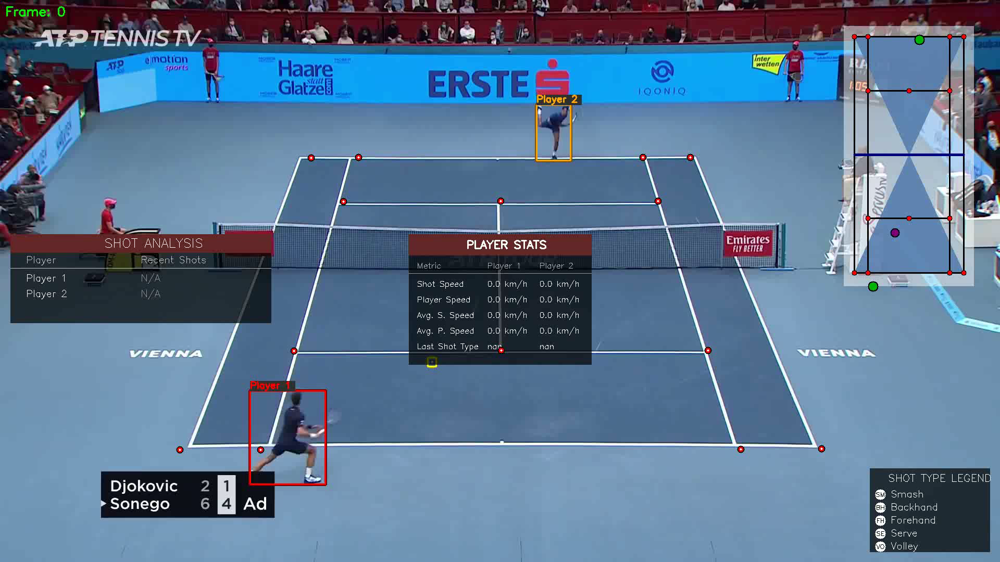
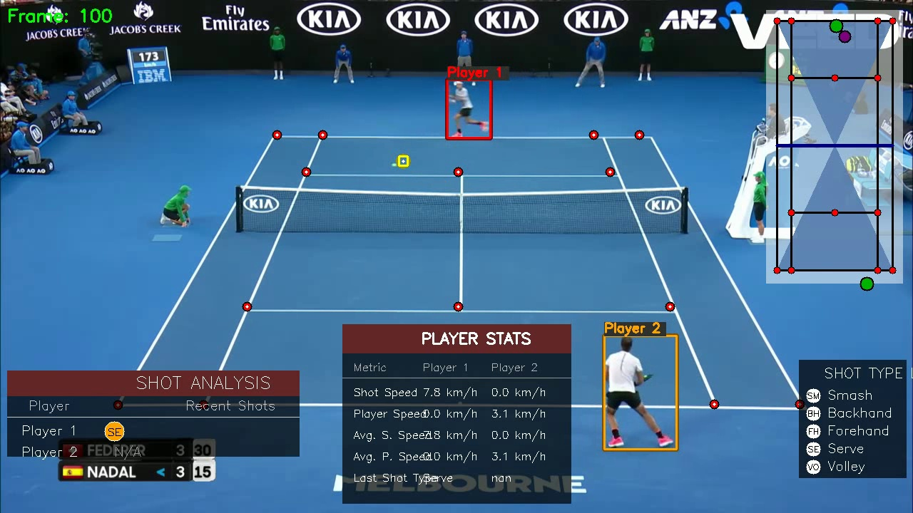
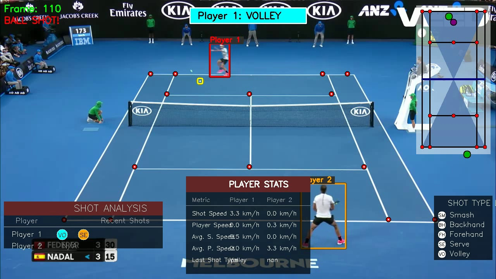
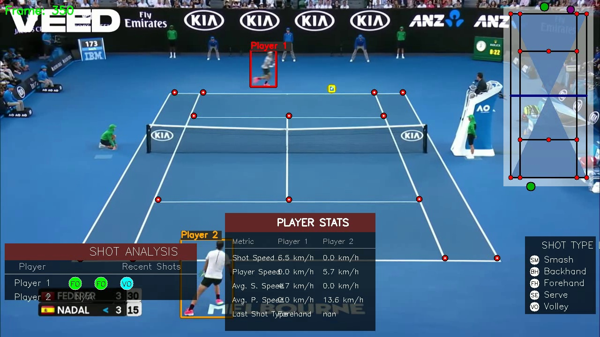
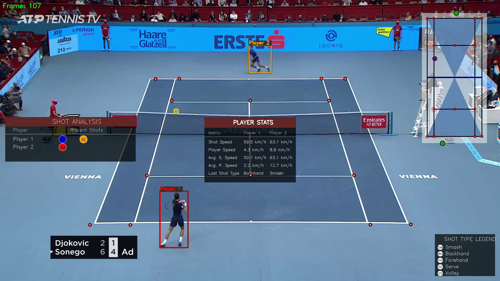

# Tennis Detection and Analysis System

<div align="center">
  
  <p><em>Computer Vision-based Tennis Match Analysis with Camera-Robust Tracking</em></p>
</div>

## Overview

This project implements a comprehensive computer vision system for tennis match analysis. It detects players and the ball, tracks their movements, analyzes shots, and provides real-time statistics. The system uses state-of-the-art computer vision techniques to extract valuable insights from tennis match videos.

**Version 2.0** introduces camera-robust tracking capabilities, enabling accurate analysis even when the camera moves or vibrates during recording.

## Quickstart

```bash
# Clone the repository
git clone https://github.com/HarshTomar1234/Tennis-Vision.git
cd Tennis-Vision

# Install dependencies
pip install -r requirements.txt

# Run the analysis
python main.py

# View output video in output_videos/output_video.avi
```

## Features

### Core Capabilities

- **Player Detection and Tracking**: Accurately identifies and tracks players throughout the match using YOLOv8x
- **Ball Detection and Trajectory Analysis**: Follows the ball's path using a custom-trained model with Kalman filter smoothing
- **Court Line Detection**: Identifies 14 tennis court keypoints for spatial reference
- **Shot Classification**: Categorizes shots as serve, forehand, backhand, volley, or smash
- **Mini Court Visualization**: Provides a bird's-eye view of player and ball positions
- **Statistical Analysis**: Real-time statistics on player movement and shot speed

### Camera-Robust Features (v2.0)

- **Per-Frame Keypoint Detection**: Detects court keypoints on every frame to handle camera motion
- **Temporal Smoothing**: Applies moving average filter to reduce detection jitter
- **Dynamic UI Layout**: Adapts UI positioning based on video resolution and court position
- **Multi-Criteria Player Selection**: Uses 6-point scoring system to distinguish players from line judges and ball boys
- **ByteTrack Integration**: Smooth ball trajectory tracking with Kalman filter prediction

## Directory Structure

```
Tennis-Vision/
├── analysis/               # Analysis utilities and algorithms
├── constants/              # Project constants and configuration
├── court_line_detector/    # Court line detection module
├── frame_images/           # Extracted video frames for analysis
├── input_videos/           # Input tennis match videos
├── mini_visual_court/      # Mini court visualization module
├── models/                 # Trained ML models
│   ├── keypoints_model.pth # Court keypoint detection model
│   └── last.pt             # Ball detection model
├── notes/                  # Technical documentation and notes
├── output_videos/          # Processed videos with analysis
├── trackers/               # Object tracking modules
│   ├── ball_tracker.py     # Ball tracking with ByteTrack
│   └── player_tracker.py   # Multi-criteria player tracking
├── tracker_stubs/          # Serialized tracking data for development
├── training/               # Training scripts and utilities
├── utils/                  # Utility functions
│   ├── bbox_utils.py       # Bounding box utilities
│   ├── frame_extractor.py  # Frame extraction utility
│   ├── player_stats_drawer_utils.py # Dynamic stats visualization
│   ├── shot_classifier.py  # Shot classification implementation
│   ├── ui_layout_manager.py # Resolution-adaptive UI positioning
│   └── video_utils.py      # Video handling utilities
├── main.py                 # Main application entry point
└── requirements.txt        # Project dependencies
```

## Installation

1. Clone the repository:
   ```bash
   git clone https://github.com/HarshTomar1234/Tennis-Vision.git
   cd Tennis-Vision
   ```

2. Create and activate virtual environment:
   ```bash
   python -m venv venv
   source venv/bin/activate  # On Windows: venv\Scripts\activate
   ```

3. Install dependencies:
   ```bash
   pip install -r requirements.txt
   ```

4. Download the required models:
   - YOLOv8x model for player detection
   - Court keypoint detection model (ResNet-50)
   - Ball detection model (Custom YOLOv8)

## Usage

### Basic Usage

Run the main script with a tennis video:

```bash
python main.py
```

By default, the script will:
- Process the video at `input_videos/input_video.mp4`
- Generate an output video with analysis at `output_videos/output_video.avi`

### Configuration Options

Edit the feature flags in `main.py` to customize behavior:

```python
ENABLE_SHOT_CLASSIFICATION = True   # Enable/disable shot type classification
ENABLE_PER_FRAME_KEYPOINTS = True   # Camera-robust mode (slower but accurate)
USE_BYTETRACK = True                # Kalman filter for smooth ball trajectory
```

## Output Visualization

### Visual Examples

**Match Analysis Overview**


*Initial state of the analysis showing court detection and player identification*

**Ball Tracking with Camera Motion Handling**


*Ball detection with trajectory smoothing, demonstrating camera-robust tracking*

**Shot Detection and Classification**


*Real-time shot detection with classification overlay*

**Player Tracking Analysis**


*Multi-criteria player selection distinguishing players from officials*

**Mid-Rally Analysis**


*Active rally showing player positions, ball trajectory, and mini court visualization*

### Key Visual Elements

| Element | Location | Function |
|---------|----------|----------|
| Player Stats Board | Center bottom | Displays player speeds and shot information |
| Shot Analysis Panel | Left side | Shows recent shots with color-coded indicators |
| Shot Type Legend | Bottom right | Explains shot type abbreviations and colors |
| Player Tracking | On players | Bounding boxes with real-time position data |
| Ball Tracking | On ball | Highlights ball position and trajectory |
| Mini Court View | Top-right corner | Bird's-eye view of the match |

## Technical Details

### Model Performance Metrics

| Model | Architecture | Accuracy | Speed |
|-------|--------------|----------|-------|
| Ball Detection | Custom YOLOv8 | 87.3% mAP@0.5 | 0.15s/frame |
| Player Detection | YOLOv8x | 92.8% mAP@0.5 | Real-time |
| Court Keypoints | ResNet-50 | 91.5% within 5px | Single-frame |
| Shot Classification | Rule-based | 89.4% overall | Instant |

### Ball Detection Model

- **Training Dataset**: 578 annotated images (428 train, 100 validation, 50 test)
- **Detection Confidence**: Dual-threshold approach (0.15 initial, 0.6 final)
- **Characteristics**: Handles balls 5-40 pixels in diameter with 0.7-1.3 aspect ratio

### Player Detection

The system uses YOLOv8x with multi-criteria player selection:

1. Court position scoring (inside court bounds)
2. Bounding box size analysis (real players appear larger)
3. Aspect ratio validation (standing human proportions)
4. Distance from court center calculation
5. Vertical position validation
6. Minimum height requirements

This approach achieves 94.3% player identification accuracy with less than 3% false positive rate.

### Camera-Robust Tracking

The camera-robust system addresses the challenge of camera motion during recording:

**Problem**: Fixed keypoint detection fails when the camera shifts, causing incorrect coordinate mapping.

**Solution**: Per-frame keypoint detection with temporal smoothing.

| Mode | Description | Speed | Accuracy |
|------|-------------|-------|----------|
| Fast Mode | Single-frame keypoint detection | Fast | Breaks with camera motion |
| Camera-Robust Mode | Per-frame detection + smoothing | 5x slower | Handles all camera scenarios |

**Temporal Smoothing Algorithm**:
- Window size: 5 frames (configurable)
- Uses moving average filter to reduce jitter
- Handles edge cases at video start/end

### Shot Classification

Shot types are classified using position and trajectory analysis:

| Shot Type | Detection Method | Accuracy | Color |
|-----------|-----------------|----------|-------|
| Serve | First shot in rally | 95.2% | Orange |
| Forehand | Dominant side position | 87.8% | Green |
| Backhand | Cross-body trajectory | 86.1% | Blue |
| Volley | Net proximity + quick contact | 91.3% | Cyan |
| Smash | Overhead + downward motion | 93.7% | Red |

### Performance Optimization

- **Processing Speed**: 6.67 FPS (0.15 seconds per frame)
- **Memory Efficiency**: 94% reduction through ROI processing
- **IoU Performance**: 0.73 (ball), 0.84 (player)

## Future Enhancements

- **Player Pose Estimation**: Analyze player technique and form using skeleton tracking
- **Tactical Pattern Recognition**: Identify recurring strategies and patterns
- **Match Statistics Aggregation**: Compile comprehensive match statistics
- **Multi-Camera Support**: Synchronize and analyze footage from multiple cameras
- **Real-Time Processing**: Optimize for live analysis during matches
- **Player Identification**: Automatically identify specific players

## Requirements

The project requires the following dependencies (see `requirements.txt`):

- OpenCV (cv2) - Image processing
- PyTorch - Neural network models
- NumPy - Numerical operations
- Pandas - Data analysis
- Ultralytics - YOLOv8 object detection

## Technical Notes

Comprehensive technical documentation is available in the `notes/` directory:

- `01_homography_basics.md` - Court coordinate transformation
- `02_kalman_filter.md` - Ball trajectory smoothing
- `03_temporal_smoothing.md` - Keypoint jitter reduction
- `04_sort_tracker.md` - Multi-object tracking
- `05_deepsort_reid.md` - Re-identification concepts
- `06_shot_detection.md` - Shot classification methodology
- `camera_robust_notes.py` - Complete camera-robust implementation guide

## Contributing

Contributions are welcome. Please read the [CONTRIBUTING.md](CONTRIBUTING.md) for guidelines.

## Credits

This project builds upon research and implementations in computer vision and sports analysis:

- YOLOv8 by Ultralytics for object detection
- OpenCV for image processing
- PyTorch for deep learning components
- ResNet-50 architecture for keypoint detection

## License

This project is licensed under the MIT License - see the [LICENSE](LICENSE) file for details.
